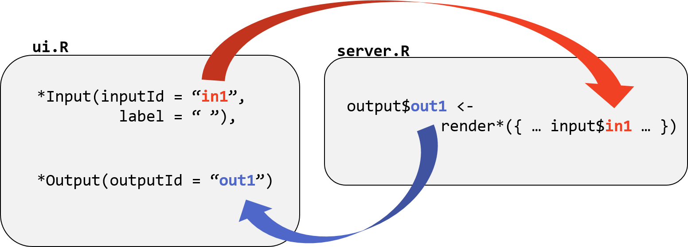
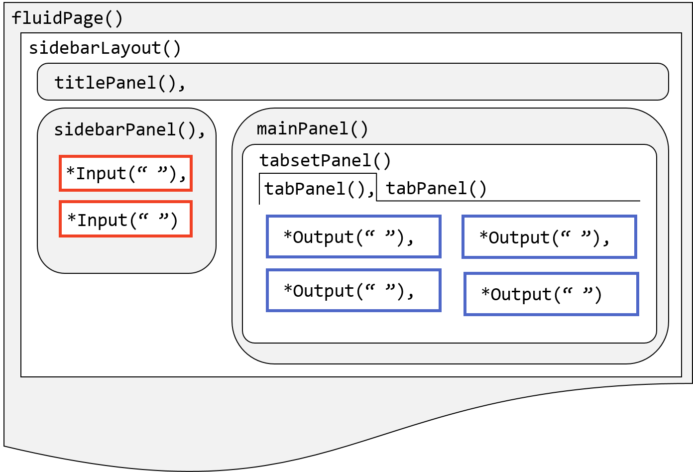
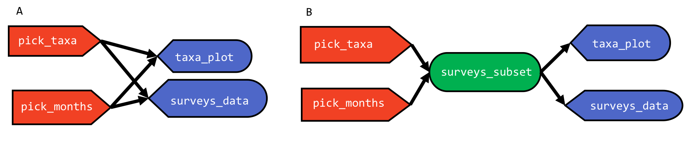
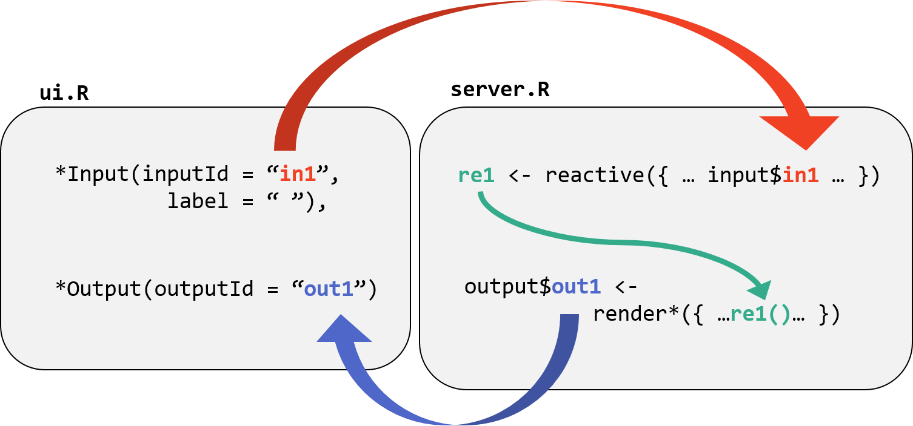
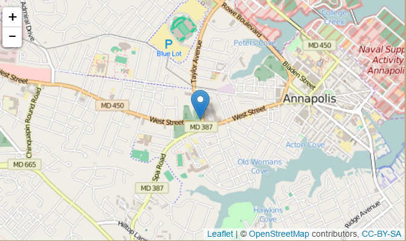
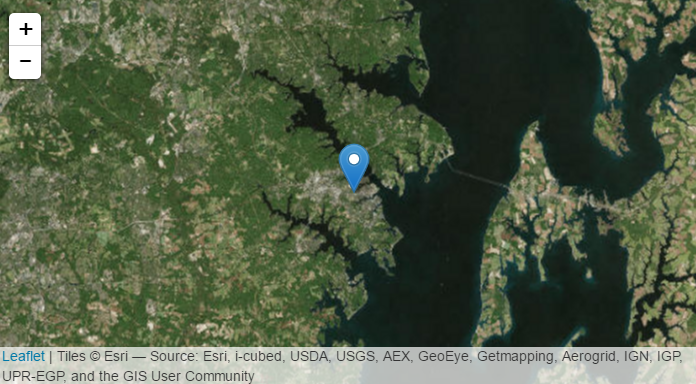
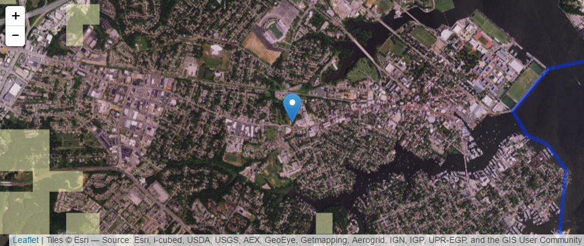

-   [Interactive web applications in R](#interactive-web-applications-in-r)
-   [File structure](#file-structure)
-   [Input and Output Objects](#input-and-output-objects)
    -   [Input Objects](#input-objects)
    -   [Output objects](#output-objects)
-   [Design and Layout](#design-and-layout)
-   [Reactive objects](#reactive-objects)
-   [Download or Upload](#download-or-upload)
-   [Share your app](#share-your-app)
    -   [Share as files](#share-as-files)
    -   [Share as a website](#share-as-a-website)
-   [Shiny extensions](#shiny-extensions)
    -   [Leaflet](#leaflet)
-   [Additional references](#additional-references)
    -   [From RStudio](#from-rstudio)
    -   [Other/ tutorials](#other-tutorials)
    -   [Example Shiny apps](#example-shiny-apps)

Interactive web applications in R
=================================

This lesson presents an introduction to creating interactive web applications using the [Shiny](https://cran.r-project.org/web/packages/shiny/index.html) package in R. We will learn about the basic building blocks of a Shiny app, how to create interactive elements, customize them, and arrange them on a page by building a Shiny app with parts of the [Portals teaching database](https://github.com/weecology/portal-teachingdb). We will also use [Leaflet](https://rstudio.github.io/leaflet/)'s R package to put a map in the app using powerful web-mapping software.

This lesson builds on concepts covered in the [data manipulation](https://github.com/SESYNC-ci/ci-spring2016/blob/master/Lessons/tidyr_dplyr.md) and [geospatial](https://github.com/SESYNC-ci/ci-spring2016/blob/master/Lessons/geospatial.md) lessons and requires the `shiny`, `dplyr`, and `leaflet` libraries. You can see the final version of the app that we will make [here](https://shiny.sesync.org/apps/csi-spring2016/).

File structure
==============

Shiny was developed by RStudio with the intention of making plots more dynamic and interactive. It can be used for exploratory data analysis and visualization, to facilitate remote collaboration, share results, and [much more](http://shiny.rstudio.com/gallery/).

The `shiny` package includes some built-in examples to demonstrate some of its basic features. When applications are running, they are displayed in a separate browser window or the RStudio Viewer pane.

> See how this works by running one of the [built-in examples](http://shiny.rstudio.com/tutorial/lesson1/#Go%20Further) within the shiny package:

``` r
library(shiny)
runExample("01_hello")
```

You may need to prevent your broswer from blocking the pop-out window. Notice the stop sign that appears in RStudio's Console window while your app is running. This is because the current R session is busy running your application. Closing the app window does not stop the app from using your R session. *Make sure to end the app when you are finished by clicking the stop sign.*

Depending on the purpose and computing requirements of any Shiny app, it may live on your computer, a remote server, or in the cloud. However all Shiny apps consists of the same two main components:

-   The **user interface** which defines what users will see in the app and its design.
-   The **server** which defines the instructions for how to assemble components of the app like plots and input widgets.

When the `shiny` package is installed and loaded, RStudio will identify this file structure and create a green arrow with a **Run App** button when you open a file in the app. Note that the file names must be exactly as specified.

The appearance of the web page (the UI) is controlled by the computer running a live R session. When you are logged into [rstudio.sesync.org](rstudio.sesync.org), that session is running on a machine here. When you are using standalone RStudio, that session is running on your laptop or desktop. Users manipulate elements within the user interface, which triggers R code to run, in turn updating UI objects.

There are two ways to structure the files for an app:

-   Create one file called `app.R`. In this file, define objects `ui` and `server` with the assignment operator `<-` and then pass them to the function `shinyApp()`.

``` r
ui <- fluidPage() 

server <- function(input, output){}

shinyApp(ui = ui, server = server)
```

-   Alternatively, split the template into two files named `ui.R` and `server.R` and save these files in the same folder. We will use this second option here to make an app.

``` r
# ui.R
fluidPage() 
```

``` r
# server.R
function(input, output){}
```

> Create a new folder in your current working directory with ui and server files. Set this as your working directory. In the ui file, create a title for your app and in the server file, read in the 3 csv files. Run your app using the Run App button.

**Put required data in app folder** Because the Shiny app is going to be using your local R session to run, it will be able to recognize anything that is loaded into your library. However it is good practice for Shiny apps to keep them "self-contained" and to include all of the Data they rely on within the file folder that contains the ui and server files. Create a new copy of the data from the public data folder into your app directory using the following code:

``` r
system("cp -R /nfs/public-data/ci-spring2016/Data/ Data/")
system("cp -R /nfs/public-data/ci-spring2016/Geodata/ Data/")
```

``` r
# ui.R

fluidPage(
  titlePanel("Hello Shiny!")
)
```

``` r
# server.R

# Read in data
plots <- read.csv("Data/plots.csv", stringsAsFactors = FALSE)
species <- read.csv("Data/species.csv", stringsAsFactors = FALSE)
surveys <- read.csv("Data/surveys.csv", na.strings = "", stringsAsFactors = FALSE)

# server function begins here
function(input, output){
  
}
```

Input and Output Objects
========================

The user interface and the server file interact with each other through **input** and **output** objects. The information in the server file is the recipe for how to construct output objects to display in the ui, and the user's interaction with input objects alters output objects based on the code in the server file. The instructions for creating input objects are in the ui file. Having your app function as you intend requires careful attention to how your input and output objects relate to each other, i.e. knowing what actions will initiate what sections of code to run at what time.

 The diagram above depicts how input and output objects are referred to within the ui and server files. Input objects are created and named in the ui file with functions like `selectInput()` or `radioButtons()`. They are used within render functions in the server file to create output objects. Output objects are placed in the ui with output functions like `plotOutput()` or `textOutput()`.

Input Objects
-------------

Input objects collect information from the user and saves it in a list. Input values change whenever a user changes the input. These inputs can be single values, text, vectors, dates, or even files uploaded by the user. The first two arguments for all input widgets are `inputId =` which is for giving the input object a name to refer to in the server file, and `label =` which is for text to display to the user. Other arguments depend on the type of input widget. Input objects are stored in a list and are referred to in the server file with the syntax `input$inputID`. A gallery of input widgets can be found on the RStudio website [here](http://shiny.rstudio.com/gallery/widget-gallery.html).

> Create an input object in the ui to allow users to select one of the four taxa in the portals data set. Use the `selectInput()` function to create an input object called `pick_taxa`. Use the `choices =` argument to define a vector with the 4 options.

``` r
# ui.R

fluidPage(
  
  titlePanel("Hello Shiny!"),

  selectInput("pick_taxa", label = "Pick a taxa", choices = unique(species$taxa))  

)
```

Input objects are **reactive** which means that an update to this value by a user will notify objects in the server file that its value has been changed.

**Some other notes on input objects**

-   Choices for inputs can be named using a list to match the display name to the value such as `list("Male" = "M", "Female" = "F")`.
-   [Selectize](http://shiny.rstudio.com/gallery/selectize-vs-select.html) inputs are a useful option for long drop down lists.
-   Always be aware of what the default value is for input objects you create.
-   If you use an input to choose a column from a data frame, take special care in how to pass the resulting `input$value` to ggplot (use `aes_string` instead of `aes`: <http://docs.ggplot2.org/dev/aes_string.html>) or dplyr functions (use the "standard evaluation" versions of functions: <https://cran.r-project.org/web/packages/dplyr/vignettes/nse.html>)

Output objects
--------------

Output objects are created through the combination of pairs of `render*()` and `*Output()` functions. The server file defines a list of output objects using render functions with the syntax:

``` r
output$plot1 <- renderPlot({})
output$dataframe1 <- renderTable({})
output$message1 <- renderText({})
```

Render functions tell Shiny **how to** build an output object to display in the user interface. Output objects can be data frames, plots, images, text, or most anything you can create with R code to be visualized. The outputs of render functions are called **observers** because they observe all upstream reactive values for changes. The code inside the body of the render function will run whenever a reactive value inside the code changes, such as when an input object's value is changed within the user interface. The input object notifies its observers that it has changed, which causes the output objects to re-render and update the display. Use outputId names in quotes to refer to output objects within `*Output()` functions. Other arguments to `*Output()` functions can control their size in the ui as well as [advanced interactions for plots](http://shiny.rstudio.com/articles/plot-interaction.html)

Here are some common pairs of render and output functions:

| render function   | output function      | displays          |
|-------------------|----------------------|-------------------|
| renderPlot()      | plotOutput()         | plots             |
| renderPrint()     | verbatimTextOutput() | text              |
| renderText()      | textOutput()         | text              |
| renderTable()     | tableOutput()        | static table      |
| renderDataTable() | dataTableOutput()    | interactive table |

It is also possible to render reactive input objects using the `renderUI()` and `uiOutput()` functions for situations where you want the type or parameters of an input widget to change based on another input. See the example "Creating controls on the fly" [here](http://shiny.rstudio.com/articles/dynamic-ui.html).

> Use the `renderPlot()` function to define an output object showing a barplot with the total number of observations per year of the taxa selected by the user in the input object. Use the corresponding `plotOutput()` function in the ui file to display the plot. Make sure to separate ui elements with commas.

``` r
# within server function

  output$taxa_plot <- renderPlot({
    taxa_subset <- filter(species, taxa == input$pick_taxa) %>%
      dplyr::select(species_id)
    surveys_subset <- filter(surveys, species_id %in% taxa_subset)
    barplot(table(surveys_subset$year))
  })
```

``` r
# within fluidPage()

plotOutput("taxa_plot")
```

> **Exercise**: Add an input widget to control the range of survey months included in the plot.

``` r
# in ui.R
sliderInput("pick_months", "Select which months to include", min = 1, max = 12, value = c(1,12)),
plotOutput("taxa_plot")

# in server.R
output$taxa_plot <- renderPlot({
  taxa_subset <- filter(species, taxa == input$pick_taxa)$species_id
  surveys_subset <- filter(surveys, species_id %in% taxa_subset & month %in% input$pick_months[1]:input$pick_months[2])
  barplot(table(surveys_subset$year))
  })
```

Design and Layout
=================

Within the user interface, you arrange where elements appear by using a page layout. You can organize elements using pre-defined high level layouts such as `sidebarLayout()`, `splitLayout()`, or `verticalLayout()`, or you can use `fluidRow()` to organize rows of elements within a grid. Elements can be layered on top of each other using `tabsetPanel()`, `navlistPanel()`, or `navbarPage()`.



The diagram above depicts nested UI elements in the sidebar layout. The red boxes represent input objects and the blue boxes represent output objects. Each object is located within one or more nested **panels**, which are nested within a **layout**. Notice that **tab panels** are nested within the **tabset panel**. Objects and panels that are at the same level of hierarchy need to be separated by commas. Mistakes in usage of commas and parentheses between UI elements is one of the first things to look for when debugging a shiny app!

The `fluidPage()` layout design consists of rows which contain columns of elements. To use it, you define the width of an element relative to a 12-unit grid within each column using the function `fluidRow()` and listing columns in units of 12. The argument `offset =` can be used to add extra spacing. For example:

``` r
# ui.R

fluidPage(
  fluidRow(
    column(4, "4"),
    column(4, offset = 4, "4 offset 4")      
  ),
  fluidRow(
    column(3, offset = 3, "3 offset 3"),
    column(3, offset = 3, "3 offset 3")  
  ))
```

> Organize your application using the [sidebar layout](http://shiny.rstudio.com/reference/shiny/latest/sidebarLayout.html). Place the input widgets in the sidebar and the plot in the main panel. *Think about where you need to put commas and parentheses!*

``` r
# in ui.R
fluidPage(
  sidebarLayout(
    sidebarPanel(
      selectInput("pick_taxa", label = "Pick a taxa", choices = unique(species$taxa)),
      sliderInput("pick_months", "Select which months to include", min = 1, max = 12, value = c(1,12))
      ),
    mainPanel(
      plotOutput("taxa_plot")
    )
  )
)
```

> Make the main panel a [tabset panel](http://shiny.rstudio.com/articles/tabsets.html) with a first tab with the plot output and a second tab with a data table output showing all of the survey data used in the plot ouput. Use the `tabsetPanel()` function with a list of tabs created with `tabPanel()`. Make sure to account for all of your parentheses!

``` r
# in server
  output$surveys_subset <- renderDataTable({
    taxa_subset <- filter(species, taxa == input$pick_taxa) %>%
      dplyr::select(species_id)
    surveys_subset <- filter(surveys, species_id %in% taxa_subset & month %in% input$pick_months[1]:input$pick_months[2])
    return(surveys_subset)
  })

# in ui
mainPanel(
      tabsetPanel(
        tabPanel("Plot",
                plotOutput("taxa_plot")),
        tabPanel("Data", 
                dataTableOutput("surveys_subset"))
      )
    )
```

Along with widgets and output objects, you can add headers, text, images, links, and other html objects to the user interface. There are shiny function equivalents for many common html tags such as `h1()` through `h6()` for headers. You can use the console command line to see that the return from these functions produce HTML code.

``` r
h1("This is html")
a(href="www.sesync.org", "This is a link")
```

> Add a bold level 3 header above the plot in the main panel that includes the name of the selected taxa.

``` r
# in server
  output$plot_title <- renderText({
    paste0("Total number of ", input$pick_taxa, "s observed by year")
  })

# in ui
h3(strong(textOutput("plot_title")))
```

> Change the overall page layout from `fluidPage()` to `navbarPage()`. Move the app title from a panel to the first argument of `navbarPage()` and wrap the `sidebarLayout()` in a tabPanel called portals. Remove the title panel.

``` r
# ui
navbarPage("csi app",
  tabPanel("portals",
  sidebarLayout(
    sidebarPanel( ... ), # code truncated
    mainPanel( ... ))    # code truncated
  )
)
```

> Exercise: Below the graph, add text that says what year had the maximum number of the selected taxa recorded. Compare the appearance of `renderText()` and `textOutput()` with `renderPrint()` and `verbatimTextOutput()`.

``` r
  output$max_year_text <- renderText({
    max_year <- names(tail(sort(table(surveys_subset()$year)),1))
    paste0("The most ", input$pick_taxa, "s were recorded in ",max_year)
  })
```

**Some other notes on ui design**

-   In addition to titles for tabs, you can also use fun [icons](http://shiny.rstudio.com/reference/shiny/latest/icon.html).
-   Use the argument `position = "right"` in the `sidebarLayout()` function if you prefer to have the side panel appear on the right.
-   See [here](http://shiny.rstudio.com/articles/tag-glossary.html) for additional html tags you can use.
-   For large blocks of text consider saving the text in a separate markdown, html, or text file and use an `include*` function ([example](http://shiny.rstudio.com/gallery/including-html-text-and-markdown-files.html)).
-   Add images by saving those files in a folder called **www**. Link to it with `img(src="<file name>")`
-   Use a shiny theme with the [shinythemes](http://rstudio.github.io/shinythemes/) package

Reactive objects
================

When your app inputs serve to create some object that is used in multiple outputs, you can enclose the corresponding code in a **reactive** function. This value is then cached to reduce computation required, since only the code to create this object is re-run when input values are updated. For example, in order to display both the plot and the data used in the plot, we had to duplicate portions of code in the `renderPlot()` and `renderDataTable()` functions.



The diagram above shows the relationship between input and output objects with (B) and without (A) the use of an intermediary reactive object. The surveys\_subset reactive object becomes cached in the app's memory so it does not need to be computed independently in both the plot and data output objects.

Use the function `reactive()` to create reactive objects and use them with function syntax, i.e. with `()`. Reactive objects are not output objects so do not use `output$` in front of their name.



The diagram above depicts the new relationship between input objects and reactive functions to produce reactive objects, which are then used in render functions.

> Make the filtered data set a reactive object called `surveys_subset` to use to render both the plot and the data table, instead of repeating the code to create the filtered data set. This object needs be created in the server file preceeding its use.

``` r
# in server

  surveys_subset <- reactive({
    taxa_subset <- filter(species, taxa == input$pick_taxa) %>%
      dplyr::select(species_id)
    # taxa_subset <- subset(species, taxa == input$pick_taxa, select = species_id) # if dplyr not loaded
    surveys_subset <- filter(surveys, species_id %in% taxa_subset)
    return(surveys_subset)
  })
```

To use `surveys_subset` in render functions, refer to it with function syntax.

``` r
# in server

  output$taxa_plot <- renderPlot({
    barplot(table(surveys_subset()$year))
  })

  output$surveys_data <- renderDataTable({
    surveys_subset()
  })
```

Download or Upload
==================

It is possible to allow users to upload and download files from a Shiny app, such as a csv file of the currently visible data. Objects to download are output objects created in the server using the function `downloadHandler()` which is analogous to the render functions. That object is made available using a `downloadButton()` or `downloadLink()` function in the ui. The `downloadHandler()` function requires two arguments:

-   **filename** which is a string or a function that returns a string ending with a file extension.
-   **content** which is a function to generate the content of the file and write it to a temporary file.

Uploading files is possible with the input function `fileInput()` to create an input object. This object is a data frame that contains a column `datapath` which can be used to locate the user's upload file locally within the app. See the [documentation](http://shiny.rstudio.com/reference/shiny/latest/fileInput.html) and [example](http://shiny.rstudio.com/gallery/file-upload.html) for more information.

> Add a button to the sidebar which allows users to download a csv of the data used to generate the plot and data table.

``` r
# in server
  output$download_data <- downloadHandler(
    filename = "portals_subset.csv",
    content = function(file) {
      write.csv(surveys_subset(), file)
    }
  )

# in ui
  downloadButton("download_data", label = "Download")
```

> Exercise: Make the name of the download file include the taxa selected in the input widget

``` r
  output$download_data <- downloadHandler(
    filename = function() { 
      paste("portals_", input$pick_taxa, ".csv", sep="") 
    },
    content = function(file) {
      write.csv(datasetInput(), file)
    }
```

Share your app
==============

Once you have made an app, there are several ways to share it with others. It is important to make sure that everything the app needs to run (data and packages) will be loaded into the R session. For example, this can be accomplished by using a `dependencies.R` or "helpers" file to load packages and data when deploying app outside of local environment, and then using the `source()` function at the beginning of the server.R and ui.R files to run that file when the app is loaded.

Share as files
--------------

-   email or copy ui.R, server.R, and all required data files
-   use functions in the shiny package to run app from files hosted on the web. For example, the files and data for the shiny app we are building are located in a github repo and can be run using `shiny::runGitHub("khondula/csi-app")`

Share as a website
------------------

To share as a webpage it will need to be hosted somewhere, i.e. there needs to be a computer running the R code that powers the app. There is limited free hosting available through RStudio with [shinapps.io](http://www.shinyapps.io/). SESYNC has a shiny server to host apps as well. There is a series of articles on the RStudio website [here](http://shiny.rstudio.com/articles/) about deploying apps.

-   [How do I publish a Shiny app on the SESYNC server](https://collab.sesync.org/sites/support/Frequently%20Asked%20Questions/How%20do%20I%20publish%20a%20Shiny%20app%20on%20the%20SESYNC%20server.aspx)

Shiny extensions
================

There are many ways to enhance and extend the functionality and sophistication of Shiny apps using existing tools and platforms. Javascript visualizations can be used in RShiny with a framework called **htmlwidgets**, which lets you access powerful features of tools like Leaflet, [plot.ly](https://plot.ly/r/shiny-tutorial/#plotly-graphs-in-shiny), and d3 within R. Since these frameworks are bridges to, or wrappers, for the original libraries and packages that may have been written in another programming language, deploying them requires becoming familiar with the logic and structure of the output objects being created. The [Leaflet package for R](https://rstudio.github.io/leaflet/) is well-integrated with other R packages like Shiny and sp however it is also useful to refer to the more extensive documentation of its [JavaScript library](http://leafletjs.com/reference.html).

**Some shiny extensions**

-   shinyjs: Enhance user experience in Shiny apps using JavaScript functions without knowing JavaScript
-   ggvis: Similar to ggplot2, but the plots are focused on being web-based and are more interactive
-   leaflet: geospatial mapping
-   [dygraphs](http://rstudio.github.io/dygraphs/): time series charting
-   metricsgraphics: scatterplots and line charts with D3
-   [networkD3](http://christophergandrud.github.io/networkD3/): graph data visualization with D3
-   [sparklines](https://github.com/htmlwidgets/sparkline): small inline charts
-   d3heatmap: interactive heatmaps with D3
-   [threejs](https://github.com/bwlewis/rthreejs): 3D scatterplots and globes
-   DiagrammeR: Diagrams and flowcharts
-   [exploding boxplot](https://rpubs.com/pssguy/143829)
-   [interaction with table cells](https://yihui.shinyapps.io/DT-click/)

Leaflet
-------

Just like plots, text, and data frames, ui elements created with htmlwidgets are based on the combination of a render function and an output function. For Leaflet, these functions are `renderLeaflet()` and `leafletOutput()`. Leaflet map output objects are defined in the render function and can incorporate input objects.

> Look at the source code for the [Superzip](http://shiny.rstudio.com/gallery/superzip-example.html) Shiny app to find where these functions are used. What is the name of the map output object?

-   [ui.R](https://github.com/rstudio/shiny-examples/blob/master/063-superzip-example/ui.R)
-   [server.R](https://github.com/rstudio/shiny-examples/blob/master/063-superzip-example/server.R)

The code inside the render function describes how to create the leaflet map object based on functions in the leaflet package. It starts with the function `leaflet()` which returns a map object, and then adds to and modifies elements of that object using the pipe operator `%>%`. Elements include background map tiles, markers, polygons, lines, and other geographical features.

> Add a new panel to the navbar called "Map" that contains a Leaflet map object with a marker at SESYNC's location. It may take some time for the map to appear.

``` r
# in server
  output$sesync_map <- renderLeaflet({
    leaflet() %>%
      addTiles() %>%
      addMarkers(lng = -76.505206, lat = 38.9767231, popup = "SESYNC")
  })

# in ui
navbarPage("CSI App",
           tabPanel("Portals" ...), # code truncated here
           tabPanel("Map", leafletOutput("sesync_map"))
)
```



Using `addTiles()` displays the default background map tiles. However there are many more options to pick from. There is a list of the free background tiles available and what they look like [here](http://leaflet-extras.github.io/leaflet-providers/preview/index.html) or you can [create your own](http://osm2vectortiles.org/maps/) using data from [OpenStreetMap](http://www.openstreetmap.org/). To use a different background specify which `ProviderTiles` to display.

> Change the background image from the default to Esri World Imagery.

``` r
# in server
  output$sesync_map <- renderLeaflet({
    leaflet() %>%
      addProviderTiles("Esri.WorldImagery") %>%
      addMarkers(lng = -76.505206, lat = 38.9767231, popup = "SESYNC")
  })

# in ui
tabPanel("Map", leafletOutput("sesync_map"))
```



Leaflet using the [Web Mercator](http://epsg.io/3857) projection. The use of a (pseudo)-conformal projection is useful for "slippy" web map features of panning and zooming since it preserves a north-up orientation. However because of some [mathematical intricacies of Web Mercator](http://www.hydrometronics.com/downloads/Web%20Mercator%20-%20Non-Conformal,%20Non-Mercator%20(notes).pdf), Leaflet will only convert objects to EPSG:3857 if it can. The Leaflet package in R does [not yet have](https://github.com/rstudio/leaflet/issues/233) the capability to handle objects that are not in common projections like WGS84.

In order to plot the `huc_md` object created in the [geospatial lesson](https://github.com/SESYNC-ci/ci-spring2016/blob/master/Lessons/geospatial.md), we will need to use non-projected coordinates instead of the Alber's equal area projection.

> Read in the counties, watershed boundaries, and NLCD datasets as in the geospatial lesson. Subset the counties to those in MD.

``` r
library(sp)
library(rgdal)
library(rgeos)
library(raster)

cb_dir <- "/nfs/public-data/census-tiger-2013/cb_2014_us_county_500k"

counties <- readOGR(dsn = file.path(cb_dir, "cb_2014_us_county_500k.shp"),
                    layer = "cb_2014_us_county_500k", 
                    stringsAsFactors = FALSE)

huc <- readOGR(dsn = "/nfs/public-data/ci-spring2016/Geodata/huc250k.shp", 
               layer = "huc250k",
               stringsAsFactors = FALSE)

nlcd <- raster("/nfs/public-data/ci-spring2016/Geodata/nlcd_agg.grd")

counties_md <- counties[counties$STATEFP == "24", ]  
```

In order to perform the union and intersection operations but preserve compatability with leaflet, transform the watershed boundaries and maryland counties to unprojected coordinate systems.

``` r
huc <- spTransform(huc, CRS("+proj=longlat +datum=WGS84"))
counties_md <- spTransform(counties_md, CRS("+proj=longlat +datum=WGS84"))
state_md <- gUnaryUnion(counties_md)
huc_md <- gIntersection(huc, state_md, byid = TRUE, 
                        id = paste(1:length(huc), huc$HUC_NAME))
```

Add the watershed boundaries in maryland layer to the map using `addPolygons()`. Overlay the NLCD data using `addRasterImage()`.

``` r
# in server
  output$sesync_map <- renderLeaflet({
    leaflet(huc_md) %>% 
      setView(lng = -76.505206, lat = 38.9767231, zoom = 7) %>%
      addProviderTiles("Esri.WorldImagery") %>%
      addMarkers(lng = -76.505206, lat = 38.9767231, popup = "SESYNC") %>%
      addPolygons(fill = FALSE)  %>%
      addRasterImage(nlcd, opacity = 0.5, maxBytes = 10*1024*1024)
      # addRasterImage(mask(nlcd, nlcd == 41, maskvalue = FALSE), opacity = 0.5)
  })
```

 The values of the `zoom` argument in `setView()` are based on zoom levels in tile management schemes. Get a sense for zoom levels of tiles [here](http://www.maptiler.org/google-maps-coordinates-tile-bounds-projection/)

Since drawing maps can be computationally intensive, interactivity within the map is typically handed outside of the main render function using a function in the server called `leafletProxy()`, and the static map elements are handled within the first render function. See an example of how to implement this [here](http://www.r-bloggers.com/r-shiny-leaflet-using-observers/) and [here](http://www.r-bloggers.com/climate-projections-by-cities-r-shiny-rcharts-leaflet/).

We can add some simple interactivity by assigning groups to **layers** and using the `addLayersControl()` function. See how this works by adding 2 different masks of the nlcd data with an additional argument `group =` in the `addRasterImage()` function. For grouped layers, add a feature to toggle between them with layers control. See documentation on this feature [here](https://rstudio.github.io/leaflet/showhide.html).

``` r
  output$sesync_map <- renderLeaflet({
     leaflet(huc_md) %>% 
      setView(lng = -76.505206, lat = 38.9767231, zoom = 7) %>%
      addProviderTiles("Esri.WorldImagery") %>%
      addMarkers(lng = -76.505206, lat = 38.9767231, popup = "SESYNC") %>%
      addPolygons(fill = FALSE, group = "MD watersheds")   %>%
      addRasterImage(mask(nlcd, nlcd == 41, maskvalue = FALSE), opacity = 0.5, 
                     group = "Deciduous Forest", colors = "green") %>%
      addRasterImage(mask(nlcd, nlcd == 81, maskvalue = FALSE), opacity = 0.5, 
                     group = "Pasture", colors = "yellow") %>%
      addLayersControl(baseGroups=c("Deciduous Forest", "Pasture"),
                       overlayGroups = c("MD watersheds"))
  })
```

Additional references
=====================

From RStudio
------------

-   [Shiny cheat sheet by RStudio](http://www.rstudio.com/wp-content/uploads/2016/01/shiny-cheatsheet.pdf)
-   [Shiny webinar chapters](http://shiny.rstudio.com/tutorial/video/) **These are particularly helpful!**
-   [Shiny tutorial by RStudio](http://shiny.rstudio.com/tutorial/)
-   [Input widget gallery](http://shiny.rstudio.com/gallery/widget-gallery.html)
-   [Advanced interactions for plots](https://gallery.shinyapps.io/095-plot-interaction-advanced/)
-   [Shiny modules](http://shiny.rstudio.com/articles/modules.html)
-   [shinyURL](https://aoles.shinyapps.io/ShinyDevCon/#1)

Other/ tutorials
----------------

-   [Building shiny app tutorial by Dean Attali](https://docs.google.com/presentation/d/1dXhqqsD7dPOOdcC5Y7RW--dEU7UfU52qlb0YD3kKeLw/edit#slide=id.p)
-   [Principles of Reactivity](https://cdn.rawgit.com/rstudio/reactivity-tutorial/master/slides.html#/) by Joe Cheng
-   [Reactivity tutorial](https://github.com/rstudio/reactivity-tutorial) by Joe Cheng
-   [NEON Shiny tutorial](http://neondataskills.org/R/Create-Basic-Shiny-App-In-R/)
-   [Geospatial libraries for R](http://www.r-bloggers.com/ropensci-geospatial-libraries/)
-   [Computerworld tutorial Create maps in R in 10 easy steps](http://www.computerworld.com/article/3038270/data-analytics/create-maps-in-r-in-10-fairly-easy-steps.html?page=2)
-   [How web maps work](https://www.mapbox.com/help/how-web-maps-work/)
-   <https://github.com/aoles/ShinyDevCon-notes>
-   [debugging in shiny](http://rpubs.com/jmcphers/149638)
-   <http://egallic.fr/maps-with-r/>
-   [Shiny articles on r-bloggers](http://www.r-bloggers.com/?s=shiny)
-   <http://www.r-bloggers.com/interactive-mapping-with-leaflet-in-r/>
-   <http://www.r-bloggers.com/upload-shapefile-to-r-shiny-app-to-extract-leaflet-map-data/>
-   [Top rated questions about shiny on stackoverflow](http://stackoverflow.com/questions/tagged/shiny?sort=votes&pageSize=15)
-   <http://www.maptiler.org/google-maps-coordinates-tile-bounds-projection/>
-   Use the Web Mercator projection for spatial analysis [at your own risk!!](http://earth-info.nga.mil/GandG/wgs84/web_mercator/index.html)

Example Shiny apps
------------------

-   <http://daattali.com/shiny/cancer-data/>
-   <https://uasnap.shinyapps.io/nwtapp/>
-   <https://shiny.sesync.org/apps/dtms-demo/network-viz/>
